# RowSense

**An AI-Enabled Unmanned Ground Vehicle (UGV) for Under-Canopy Crop Scouting**

A compact, low-cost 4WD rover that drives autonomously between wheat rows *under the canopy*, holds a straight line with IMU feedback, avoids obstacles from a depth stream, turns at row ends using orange cone markers, and flags wheat heads, tillers, and stripe rust with an on-board YOLO detector — with **no GPS, no LiDAR, and no SLAM**.

Senior Year Project (Session 2025–2026), Department of Electrical Engineering, Syed Babar Ali School of Science and Engineering, **Lahore University of Management Sciences (LUMS)**, Pakistan.

<!-- PLACEHOLDER: hero shot of the finished green rover, ideally in the wheat plot -->
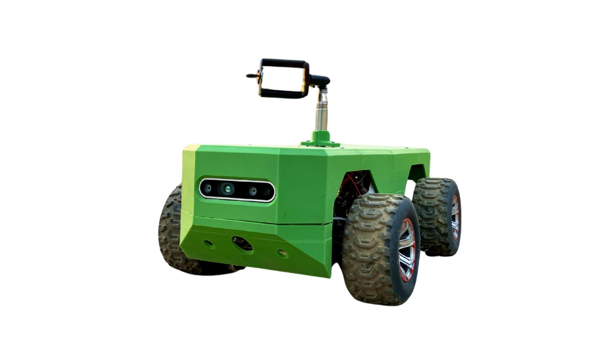
*Fig. 1 — The RowSense rover (final build).*

> **If the figures below don't render,** every one of them also appears in the full project report at [`docs/SPROJ_Report.pdf`](docs/SPROJ_Report.pdf) — figure numbers are noted in each caption. GitHub serves README images from `raw.githubusercontent.com`, which some networks block or filter; the report PDF is served from `github.com` and is unaffected.

---

## Table of Contents

- [Why RowSense](#why-rowsense)
- [Key Features](#key-features)
- [System Architecture](#system-architecture)
- [Hardware](#hardware)
- [Repository Structure](#repository-structure)
- [Installation](#installation)
- [Running the Rover](#running-the-rover)
- [Autonomy Stack](#autonomy-stack)
- [Pi ↔ ESP32 Serial Protocol](#pi--esp32-serial-protocol)
- [ROS 2 Topics](#ros-2-topics)
- [Perception Model](#perception-model)
- [Results](#results)
- [Tuning Guide](#tuning-guide)
- [Troubleshooting](#troubleshooting)
- [Cost Breakdown](#cost-breakdown)
- [Limitations and Future Work](#limitations-and-future-work)
- [Team](#team)
- [Acknowledgments](#acknowledgments)
- [Citation](#citation)
- [License](#license)
- [References](#references)

---

## Why RowSense

Pests and plant diseases account for an estimated **20–40% of global crop losses** every year, and the earliest symptoms — small lesions, discoloration, subtle canopy deformation — show up at the plant and leaf level, usually *below* the upper canopy.

UAVs are excellent at large-area monitoring but are fundamentally limited by a top-down viewpoint: foliage occludes early symptoms, and rotor downwash blurs exactly the fine texture that early detection depends on.

RowSense does not replace aerial sensing — it complements it with a **lateral, under-canopy viewpoint** that looks directly at stems, leaves, and soil-level features from *inside* the crop bed. Because it navigates from a camera and an IMU alone, it also works where GNSS is unreliable: under dense foliage, near tall trees, greenhouses, and farm infrastructure.

In the Pakistani context, where wheat aphid infestations can cause 20–80% yield losses and farmers often respond with blanket pesticide spraying, an affordable under-canopy scout that flags problem areas early can directly cut chemical waste.

---

## Key Features

| | |
|---|---|
| **GPS-free, LiDAR-free autonomy** | Behaviour-based stack running entirely on a Raspberry Pi 5 |
| **IMU heading hold** | Discrete PID on yaw + dead-reckoned cross-track correction over a 30 m bed |
| **Depth-based obstacle avoidance** | Path-frame corridor mask with a 5-state DRIFT_OUT → TRAVERSE → DRIFT_BACK machine |
| **Vision-based row-end turning** | HSV cone detection driving a serpentine 90°–90° headland turn |
| **On-edge crop detection** | YOLO detector for wheat heads, tillers, and leaf stripe rust |
| **Manual / autonomous switching** | Live `auto` / `manual` / `stop` console over the Pi→ESP32 serial bridge |
| **Annotated run recording** | Every autonomous run writes an overlaid RGB video for post-run review |
| **Low cost** | PKR 242,000 total BoM (~PKR 150,000 without the GoPro) |

---

## System Architecture

<!-- PLACEHOLDER: Fig. 1 from the report — general block diagram (power, sensors, compute, actuation, offline analysis) -->
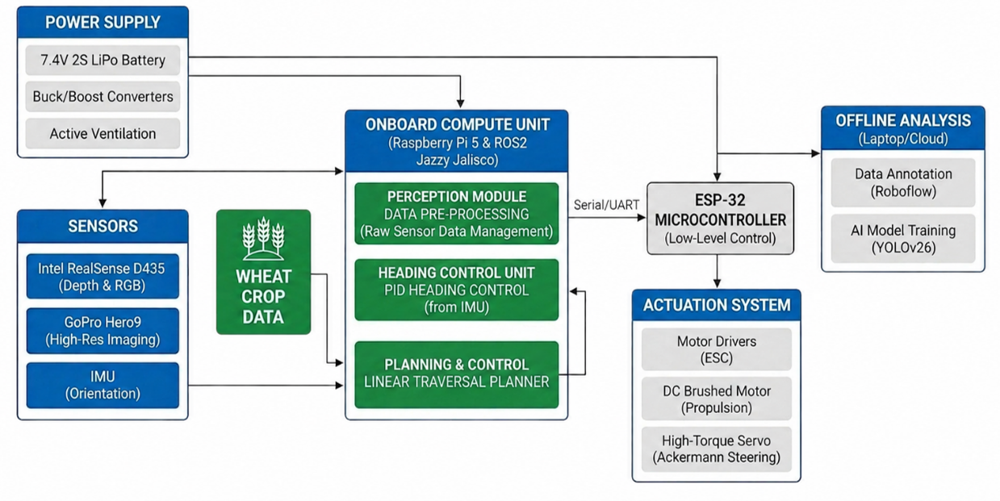
*Fig. 2 — General block diagram.*

<!-- PLACEHOLDER: Fig. 4 from the report — system-level design (hardware + software block, model block) -->
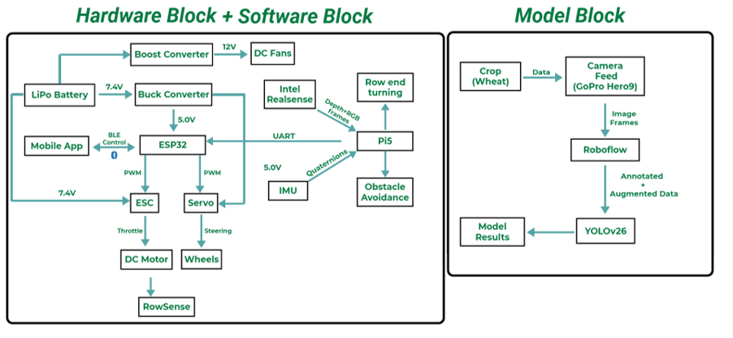
*Fig. 3 — System-level design.*

Compute is split across two nodes:

- **ESP32-S3** — hard real-time motion controller. Generates one PWM channel for the ESC (throttle) and one for the steering servo, and exposes a BLE interface to a companion mobile app for manual driving, commissioning, and emergency override.
- **Raspberry Pi 5 (8 GB)** — the autonomy stack. Consumes aligned RGB-D from the Intel RealSense D435 and quaternions from the WheelTec N100 IMU, runs the three perception behaviours, and forwards velocity commands to the ESP32 over UART.

Splitting hard real-time PWM generation onto a microcontroller while keeping perception on a Linux SBC keeps both sides simple and matches the decoupling common in practical robotics stacks.

A **behaviour-based architecture** was chosen over full SLAM or an end-to-end learned policy: behaviours are independently testable, easy to interpret, and degrade gracefully (a missed cone just falls back to heading hold instead of corrupting a global map). The trade-off is no global replanning if a row is blocked end-to-end — acceptable for straight-line traversal between known beds.

---

## Hardware

<!-- PLACEHOLDER: Fig. 15 from the report — labelled top-down view of the on-board electronics -->
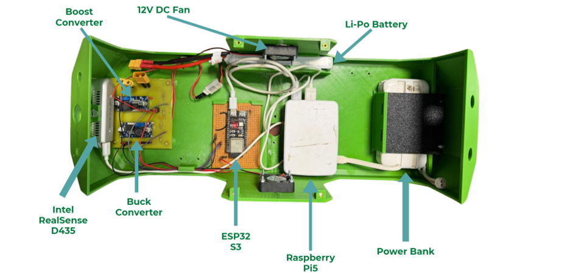
*Fig. 4 — Labelled view of on-board components.*

### Bill of materials

| Subsystem | Component |
|---|---|
| Chassis | Outsourced 4WD platform, stiffened shocks/springs, custom acrylic base plate, 3D-printed cover |
| Propulsion | Brushed DC motor + configurable 2S-compatible ESC |
| Steering | High-torque 13–15 kg·cm servo (upgraded from stock 2.8 kg·cm) |
| Motion control | ESP32-S3 microcontroller |
| Compute | Raspberry Pi 5, 8 GB RAM, 128 GB storage |
| Depth/RGB | Intel RealSense D435 stereo depth camera |
| Orientation | WheelTec N100 IMU (FDILink protocol over USB serial) |
| Dataset capture | GoPro Hero 9, adjustable-height mount, 2.7K @ 120 fps |
| Power | 7.4 V 2S 4000 mAh 30C LiPo; buck → 5.0 V; boost → 12 V; 10,000 mAh USB power bank for the Pi |
| Thermal | 2 × 12 V DC fans |

### Power topology

```
7.4 V 2S LiPo ─┬─► ESC (direct 7.4 V) ──► brushed DC motor
               ├─► Buck  → 5.0 V ──► ESP32-S3 + steering servo
               └─► Boost → 12 V ──► 2 × cooling fans

10,000 mAh USB power bank ──► Raspberry Pi 5   (isolated from motor transients)
```

All subsystems share a common ground. The Pi is deliberately powered from a separate bank so that motor current transients cannot brown it out mid-run.

### Chassis modifications

The stock platform had four problems, each addressed:

| Problem | Fix |
|---|---|
| Soft suspension — excessive bounce under payload | Stiffer shocks/springs |
| 2.8 kg·cm steering servo — unreliable turning under load | 13–15 kg·cm high-torque servo |
| Black-box ESC with unconfigurable logic | Configurable 2S-compatible ESC |
| No mounting surface for sensors | Acrylic base plate + 3D-printed cover |

4WD was preferred over 2WD differential drive because the LUMS wheat plots have raised beds with 40–50° embankments and loose soil, where 2WD platforms lost traction during in-row corrections.

<!-- PLACEHOLDER: Fig. 14 — side-by-side of red prototype and green final build -->
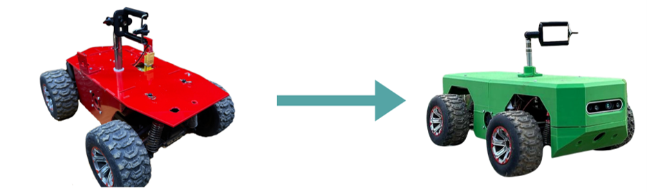
*Fig. 5 — Hardware evolution: prototype → final build.*

---

## Repository Structure

```
RowSense/
├── README.md
├── LICENSE
├── .gitignore
├── requirements.txt
│
├── navigation/                     # Runs on the Raspberry Pi 5
│   ├── nav.py                      # Main autonomy node (heading hold + avoidance + row-end turn)
│   └── auto_manual_mode_switch.py  # Pi ↔ ESP32 serial bridge + AUTO/MANUAL console
│
├── perception/                     # Runs on a CUDA workstation
│   ├── train.py                    # YOLO training entry point
│   ├── predict.py                  # Batch inference on a test folder
│   └── dataset_custom.yaml         # Dataset paths + class names
│
├── ros2_ws/
│   └── src/
│       └── wheeltec_n100_imu_py/   # Our Python FDILink driver for the N100 IMU
│
├── firmware/
│   └── esp32_s3/                   # Arduino sketch: UART → PWM + BLE manual control
│
└── docs/
    ├── SPROJ_Report.pdf            # Full project report
    └── images/                     # Figures referenced in this README
```

Third-party ROS 2 packages (`ros2_wheeltec_n100_imu`, `serial-ros2`) are **not vendored** — they are cloned during setup. See [Installation](#installation).

---

## Installation

### Prerequisites

- Ubuntu 24.04 on Raspberry Pi 5 (64-bit)
- **ROS 2 Jazzy Jalisco**
- Python 3.12
- `librealsense2` + `realsense2_camera` ROS 2 package

### 1. ROS 2 Jazzy

```bash
sudo apt update && sudo apt install -y ros-jazzy-desktop ros-dev-tools
echo "source /opt/ros/jazzy/setup.bash" >> ~/.bashrc
source ~/.bashrc
```

### 2. RealSense D435 driver

The official RealSense ROS wrapper supports Ubuntu 24.04 / Jazzy, so the apt packages are the path of least resistance. **Try apt first — don't start by building from source.**

```bash
sudo apt update
sudo apt install -y ros-jazzy-realsense2-camera ros-jazzy-realsense2-description
sudo apt install -y ros-jazzy-librealsense2-tools    # optional: realsense-viewer etc.
```

If the tools package isn't found in your apt index, install the Intel-provided equivalent (`librealsense2-utils`) from Intel's repository instead — it provides the same `realsense-viewer` binary.

**Verify the camera outside ROS before touching ROS.** Plug the D435 into a **USB 3.0** port and confirm the kernel sees it:

```bash
lsusb | grep -i intel     # expect: Intel(R) RealSense(TM) Depth Camera D435
realsense-viewer          # expect: Color, Depth, Infrared 1, Infrared 2 streams
```

If `realsense-viewer` can't stream, the problem is librealsense or the USB link — not ROS, and not RowSense. Fix it here first.

> **The D435 has no IMU.** Gyro/accel streams belong to the D435i. RowSense gets all its orientation data from the separate WheelTec N100, which is why heading hold depends on that device being up (Step 1 of the run sequence).

**Fallback — building the wrapper from source.** Only if the apt route fails:

```bash
cd ~/ros2_ws/src
git clone https://github.com/realsenseai/realsense-ros.git -b ros2-master

cd ~/ros2_ws
sudo apt install -y python3-rosdep
rosdep install -i --from-path src --rosdistro jazzy --skip-keys=librealsense2 -y
colcon build --symlink-install
source install/setup.bash
```

`--skip-keys=librealsense2` matters: without it rosdep tries to resolve the SDK as a ROS dependency and fails, since it's installed system-wide rather than as a ROS package.

### 3. Python dependencies

```bash
pip install -r requirements.txt
```

On the Pi: `opencv-python`, `numpy`, `pyserial`. On the training workstation: `ultralytics`, `torch` (CUDA build).

### 4. Clone and build the workspace

```bash
mkdir -p ~/ros2_ws/src && cd ~/ros2_ws/src

# Our Python IMU driver
cp -r /path/to/RowSense/ros2_ws/src/wheeltec_n100_imu_py .

# Third-party dependencies
git clone https://github.com/RoverRobotics-forks/serial-ros2.git
git clone https://github.com/NDHANA94/ros2_wheeltec_n100_imu.git

cd ~/ros2_ws
colcon build --symlink-install
source install/setup.bash
echo "source ~/ros2_ws/install/setup.bash" >> ~/.bashrc
```

### 5. Serial permissions

Both the IMU and the ESP32 enumerate as USB serial devices. Add yourself to `dialout` so you don't need `sudo`:

```bash
sudo usermod -aG dialout $USER   # log out and back in
ls /dev/ttyACM* /dev/ttyUSB*     # confirm both devices appear
```

> **Tip:** with two USB serial devices attached, `/dev/ttyACM0` and `/dev/ttyUSB0` can swap between boots. Add udev rules keyed on the USB serial number to pin stable names such as `/dev/rowsense_imu` and `/dev/rowsense_esp32`.

---

## Running the Rover

Four terminals, in this order. Every terminal needs the ROS environment sourced first.

<!-- PLACEHOLDER: Fig. 20 from the report — autonomous operation overview -->
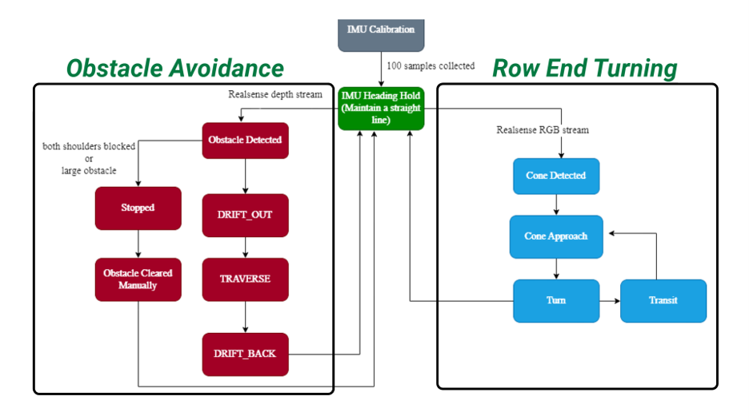
*Fig. 6 — Autonomous operation overview: how the three behaviours interact.*

### Step 1 — WheelTec N100 IMU

```bash
source /opt/ros/jazzy/setup.bash
source ~/ros2_ws/install/setup.bash

ros2 run wheeltec_n100_imu_py imu_node --ros-args \
  -p serial_port:="/dev/ttyUSB0" \
  -p serial_baud:=921600
```

Verify before continuing:

```bash
ros2 topic hz /imu     # expect ~100 Hz
```

### Step 2 — RealSense D435

Minimal launch:

```bash
source /opt/ros/jazzy/setup.bash

ros2 launch realsense2_camera rs_launch.py align_depth.enable:=true
```

> **`align_depth.enable:=true` is required.** Cone distance is looked up from `/camera/camera/aligned_depth_to_color/image_raw`; without alignment that topic is never published and row-end turning will never confirm a cone.

**Recommended launch for the Pi 5.** The default profile brings up more streams than RowSense uses, and the Pi has limited headroom once `nav.py` is running three timers on top of it. `nav.py` consumes only the colour, depth, and aligned-depth streams — the infrared pair is pure overhead here:

```bash
ros2 launch realsense2_camera rs_launch.py \
    align_depth.enable:=true \
    enable_color:=true \
    enable_depth:=true \
    enable_infra1:=false \
    enable_infra2:=false \
    pointcloud.enable:=false \
    rgb_camera.color_profile:=640x480x30 \
    depth_module.depth_profile:=640x480x30
```

Leaving the point cloud off matters: `nav.py` does its own back-projection from the raw depth frame using the intrinsics from `camera_info`, so a wrapper-side point cloud is duplicated work the Pi pays for every frame.

Verify:

```bash
ros2 topic list | grep camera
ros2 topic hz /camera/camera/color/image_raw
ros2 topic hz /camera/camera/depth/image_rect_raw
ros2 topic hz /camera/camera/aligned_depth_to_color/image_raw
ros2 topic echo /camera/camera/depth/camera_info --once
```

All three image topics should hold ~30 Hz, and `camera_info` must return a populated `k` matrix — `nav.py` cannot back-project without those intrinsics and will silently never declare an obstacle if they never arrive.

To inspect the streams visually, `rviz2` → **Add → By topic** → pick the colour and depth images, with **Fixed Frame** set to `camera_link`.

### Step 3 — Mode switch bridge

```bash
source /opt/ros/jazzy/setup.bash
python3 navigation/auto_manual_mode_switch.py
```

This opens the ESP32 serial port (auto-detects the first `/dev/ttyACM*`, then `/dev/ttyUSB*`), starts in **MANUAL**, and gives you an interactive console. Keep this terminal focused — it is your kill switch.

```
auto     -> switch to AUTO   (forwards /cmd_vel to the ESP32)
manual   -> switch to MANUAL (stops forwarding /cmd_vel)
stop     -> send a single zero-velocity command
help     -> reprint the commands
q        -> quit
```

To override the auto-detected port:

```bash
python3 navigation/auto_manual_mode_switch.py --ros-args \
  -p port:="/dev/ttyACM0" -p baud:=115200
```

### Step 4 — Navigation node

```bash
source /opt/ros/jazzy/setup.bash
python3 navigation/nav.py
```

On startup the node runs a **standstill heading calibration**: hold the rover still, pointing down the bed, for ~1.5 s while it collects at least 100 yaw samples and stores their circular mean as the target heading for the row. It will log when the heading is locked.

### Step 5 — Go autonomous

Switch back to the mode-switch terminal and type:

```
auto
```

The rover now drives down the bed on heading hold, drifts around obstacles it detects in the corridor, and performs a serpentine 90°–90° turn into the next row when it confirms the headland cones. Type `manual` at any time to cut the command stream.

An annotated RGB video of the run is written to `~/recordings/` with state, obstacle bbox, cone bbox, distances, and lateral offset overlaid.

<!-- PLACEHOLDER: short GIF or still from an annotated run video -->
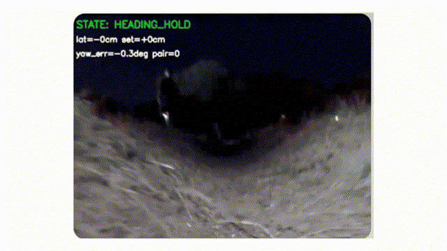
*Fig. 7 — Annotated run recording with live state overlay.*

---

## Autonomy Stack

Three cooperating behaviours share the depth and RGB streams. Row-end turning takes precedence over heading hold once cones are confirmed; obstacle avoidance temporarily overrides heading hold whenever the corridor mask reports a blocked frame; and the depth pipeline is gated off entirely for the duration of a row-end turn.

### 1. IMU-based linear traversal

<!-- PLACEHOLDER: Fig. 17 from the report — IMU-based linear traversal pipeline -->
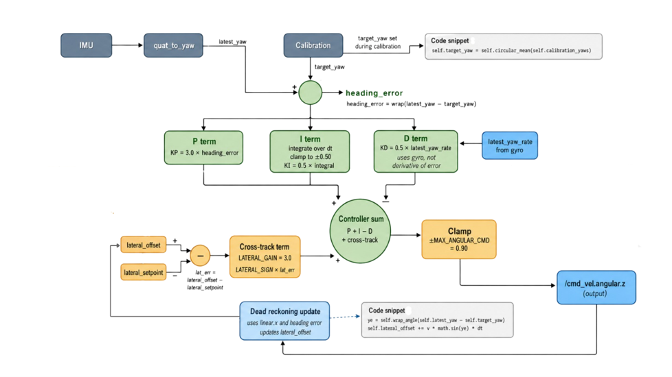
*Fig. 8 — IMU heading-hold pipeline.*

Quaternions arrive at 100 Hz and are converted to yaw. Heading error is the wrapped difference between the latest yaw and the calibrated target. A discrete PID then acts on it:

- **P** reacts to the current heading error.
- **I** cancels slow drift, clamped to prevent windup.
- **D** uses the IMU's gyro rate directly rather than a noisy numerical derivative of the error.

A **cross-track term** is layered on top so the rover returns to the centre of the bed even when its heading is already correct. A dead-reckoning update integrates linear velocity and projects the wrapped heading error into a lateral offset:

```
lateral_offset += v · sin(heading_error) · dt
```

which is compared against the lateral setpoint. PID and cross-track outputs are summed, clamped, and published as `/cmd_vel.angular.z`. Without this, small standing yaw errors accumulate into large lateral excursions over a 30 m bed.

| Parameter | Value | Meaning |
|---|---|---|
| `KP` / `KI` / `KD` | 3.0 / 0.5 / 0.5 | PID gains on heading error |
| `INTEGRAL_CLAMP` | ±0.50 | Anti-windup limit |
| `LATERAL_GAIN` | 3.0 | Cross-track correction gain |
| `LATERAL_OFFSET_CLAMP` | 1.0 m | Max dead-reckoned lateral offset |
| `MAX_ANGULAR_CMD` | 0.60 rad/s | Output clamp on `angular.z` |
| `CONTROL_RATE_HZ` | 30.0 | Control loop rate |
| `LINEAR_SPEED_INITIAL` | 0.35 | Startup speed |
| `LINEAR_SPEED` | 0.25 | Cruise speed |
| `SPEED_SWITCH_DISTANCE_M` | 0.45 | Distance at which cruise speed takes over |
| `CALIBRATION_TIME_SEC` | 1.5 | Standstill calibration window |
| `CALIBRATION_MIN_SAMPLES` | 100 | Minimum yaw samples before heading lock |
| `IMU_TIMEOUT` | 0.25 s | Stop if no IMU message within this window |

### 2. Depth-based obstacle avoidance

<!-- PLACEHOLDER: Fig. 18 from the report — obstacle avoidance pipeline and state machine -->
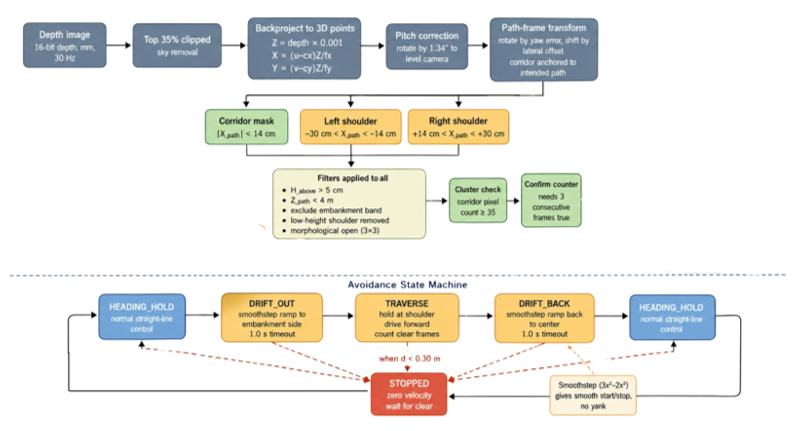
*Fig. 9 — Obstacle-avoidance pipeline and state machine.*

Each 16-bit depth frame is scaled to metres, the **top 35% of pixels are clipped** to drop sky and far-field background, and the remainder is back-projected to 3D camera-frame points:

```
Z = depth
X = (u − cx) · Z / fx
Y = (v − cy) · Z / fy
```

A small pitch correction levels the camera. Then the key design choice: a **path-frame transform** rotates the point cloud by the current yaw error and shifts it by the dead-reckoned lateral offset, so the corridor mask follows the rover's *intended trajectory* rather than its instantaneous body frame. This is what fixed the false-obstacle problem caused by flanking embankments in earlier iterations — without it, every heading correction swung the mask into the side of the bed.

Three masks are applied to the transformed cloud:

| Mask | Band | Purpose |
|---|---|---|
| Corridor | \|X_path\| < 14 cm | Points inside the bed — real obstacles |
| Left shoulder | −30 cm < X_path < −14 cm | Embankment-flanking detections |
| Right shoulder | +14 cm < X_path < +30 cm | Embankment-flanking detections |

Common filters then enforce a minimum height above ground (> 5 cm), a maximum forward distance (< 4 m), exclusion of a known embankment band, removal of low-height shoulder noise, and a 3 × 3 morphological open to kill single-pixel artefacts. An obstacle is only declared with **≥ 35 corridor pixels in the cluster across 3 consecutive confirming frames** — which dramatically reduces false positives from fallen leaves and dust on the lens.

Once confirmed, a five-state machine runs:

| State | Behaviour |
|---|---|
| `HEADING_HOLD` | Default straight-line control |
| `DRIFT_OUT` | Smoothstep ramp (3x² − 2x³) to the side shoulder |
| `TRAVERSE` | Hold at the shoulder until enough clear frames are seen |
| `DRIFT_BACK` | Same smoothstep profile back to centre |
| `STOPPED` | Zero velocity; wait for clear or operator intervention |

The smoothstep profile is what makes the lateral transitions jerk-free. `STOPPED` is entered from **any** state when both shoulders are blocked simultaneously or obstacle distance drops below 0.30 m.

| Parameter | Value |
|---|---|
| `DETECT_DISTANCE_M` | 4.0 m |
| `OBSTACLE_DIST_CRITICAL` | 0.30 m |
| `CORRIDOR_HALF_WIDTH_M` | 0.14 m |
| `SHOULDER_OUTER_HALF_M` | 0.30 m |
| `GROUND_HEIGHT_THRESHOLD_M` | 0.05 m |
| `MIN_OBSTACLE_PIXELS` | 35 |
| `OBSTACLE_CONFIRM_FRAMES` / `OBSTACLE_CLEAR_FRAMES` | 3 / 8 |
| `DEPTH_PROCESS_RATE_HZ` | 10.0 |
| `MIN_VALID_DEPTH` / `MAX_VALID_DEPTH` | 0.35 m / 4.5 m |
| `LINEAR_SPEED_AVOID` | 0.30 |
| `DRIFT_OUT_TIMEOUT_SEC` / `DRIFT_BACK_TIMEOUT_SEC` | 1.0 s / 1.0 s |
| `CAMERA_HEIGHT_M` / `CAMERA_PITCH_RAD` | 0.12 m / 0.0235 rad |

### 3. Vision-based row-end turning

<!-- PLACEHOLDER: Fig. 19 from the report — row-end turning pipeline and state sequence -->
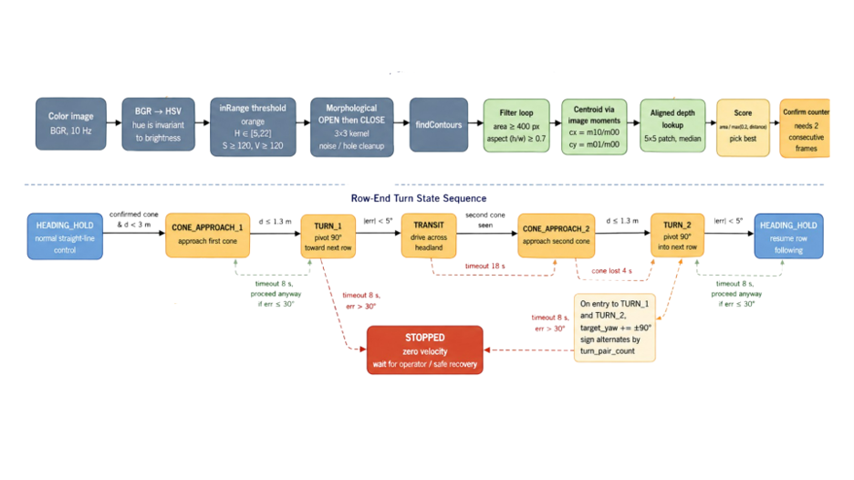
*Fig. 10 — Row-end turning pipeline and state sequence.*

Orange traffic cones mark the headlands. RGB frames are converted BGR → HSV (hue is largely invariant to brightness), an `inRange` threshold extracts cone pixels, a 3 × 3 morphological OPEN-then-CLOSE cleans the mask, and `findContours` produces candidate blobs. Candidates survive only if they clear a minimum area and a minimum height-over-width aspect ratio, so horizontal stripes of orange ground cover are rejected.

Each survivor's centroid comes from image moments, and depth at the centroid is read from the aligned depth frame using a **5 × 5 patch median** for robustness. A **physical-height sanity check** then rejects anything whose estimated metric height (`bbox_height_px · Z / fy`) falls outside 0.10–0.55 m — this is what keeps tall thin orange objects like warning signs and posts from being treated as cones. A scoring function `area / max(0.2, distance)` picks the best candidate, confirmed over 2 consecutive frames.

Once a cone is confirmed within the preempt distance, the depth-obstacle pipeline is gated off and the row-end sequence runs:

```
CONE_APPROACH_1 → TURN_1 → TRANSIT_BETWEEN_ROWS → CONE_APPROACH_2
                → TURN_2 → POST_TURN_SETTLE → HEADING_HOLD
```

On entry to each turn, `target_yaw` shifts by ±90°, with the **sign alternating by a turn-pair counter** so the rover snakes through successive headlands (pair 0 = right-right, pair 1 = left-left, and so on). The turn is a pivot in place using a dedicated angular speed rather than the PID output, which would otherwise be clamped by `MAX_ANGULAR_CMD` and take far too long.

`POST_TURN_SETTLE` exists because after `TURN_2` the wheels are still steered from the pivot and the rover sits in the cross-row gap, where the side embankment reads as a corridor obstacle. It drives straight at low speed for a short buffer with the depth pipeline still gated off, letting the chassis straighten and clear the turn region before avoidance comes back online.

Timeouts and recoveries: if a `TURN` times out without bringing heading error below tolerance, the controller falls through when the residual error is small, or escalates to `STOPPED` when it is large.

| Parameter | Value |
|---|---|
| `CONE_HSV_LOWER` → `CONE_HSV_UPPER` | `[0, 70, 70]` → `[28, 255, 255]` |
| `CONE_MIN_AREA_PX` | 200 px |
| `CONE_MIN_ASPECT_H_OVER_W` | 0.7 |
| `CONE_CONFIRM_FRAMES` | 2 |
| `CONE_DETECT_RATE_HZ` | 10.0 |
| `CONE_PREEMPT_DIST_M` | 4.0 m |
| `CONE_APPROACH_DIST_M` | 1.7 m |
| `CONE_TURN_TRIGGER_M` | 1.3 m |
| `CONE_LOST_TIMEOUT_SEC` | 4.0 s |
| `CONE_MIN/MAX_PHYSICAL_HEIGHT_M` | 0.10 m / 0.55 m |
| `TURN_ANGULAR_SPEED` | 1.0 rad/s |
| `TURN_HEADING_TOLERANCE_RAD` | 5° |
| `TURN_TIMEOUT_SEC` | 8.0 s |
| `TRANSIT_LINEAR_SPEED` / `TRANSIT_TIMEOUT_SEC` | 0.14 / 18.0 s |
| `POST_TURN_SETTLE_*` | 0.18 speed / 0.35 m / 4.0 s |

Set `ROW_END_TURN_ENABLED = False` in `nav.py` to disable cone-triggered turns for pure obstacle-avoidance testing — all cone code stays intact, only the trigger in `HEADING_HOLD` is gated.

---

## Pi ↔ ESP32 Serial Protocol

A deliberately simple newline-terminated text protocol at 115200 baud. `auto_manual_mode_switch.py` is the only writer; the ESP32 echoes back status lines which are printed to the console prefixed `[ESP32]`.

**Pi → ESP32**

| Line | Meaning |
|---|---|
| `AUTO` | Enter autonomous mode |
| `MANUAL` | Enter manual mode; ignore incoming velocity |
| `CMD_VEL <linear.x> <angular.z>` | Velocity setpoint, 4 decimal places, sent at 50 Hz while in AUTO |

Example:

```
CMD_VEL 0.2500 -0.1832
```

**ESP32 → Pi** — free-form ACK/echo status lines, surfaced verbatim to the operator.

In MANUAL, `/cmd_vel` is still subscribed and cached but **never forwarded**, so the navigation node can be left running while the rover sits idle.

---

## ROS 2 Topics

| Topic | Type | Direction | Notes |
|---|---|---|---|
| `/imu` | `sensor_msgs/Imu` | N100 driver → `nav.py` | ~100 Hz, RELIABLE QoS |
| `/camera/camera/depth/image_rect_raw` | `sensor_msgs/Image` | RealSense → `nav.py` | 16UC1, BEST_EFFORT QoS |
| `/camera/camera/depth/camera_info` | `sensor_msgs/CameraInfo` | RealSense → `nav.py` | Supplies fx, fy, cx, cy |
| `/camera/camera/color/image_raw` | `sensor_msgs/Image` | RealSense → `nav.py` | Cone detection + video overlay |
| `/camera/camera/aligned_depth_to_color/image_raw` | `sensor_msgs/Image` | RealSense → `nav.py` | **Requires `align_depth.enable:=true`** |
| `/cmd_vel` | `geometry_msgs/Twist` | `nav.py` → bridge | Only `linear.x` and `angular.z` are used |
| `/obstacle_alert` | `std_msgs/String` | `nav.py` → any | Human-readable state/obstacle events |

Sensor streams use BEST_EFFORT with depth 1 — for a reactive controller, the newest frame matters and a stale queued frame is worse than a dropped one. The IMU uses RELIABLE because dropped orientation samples corrupt the dead-reckoned lateral offset.

---

## Perception Model

### Dataset

Collected on the LUMS wheat plots over an **11-week cycle (January–April)** covering the Galaxy wheat variety from emergence through grain ripening. The GoPro Hero 9 was mounted on the rover and driven manually between two adjacent wheat rows; one dataset was captured per week, 11 in total.

<!-- PLACEHOLDER: Fig. 21 — week 1 / week 5 / week 11 crop cycle progression -->
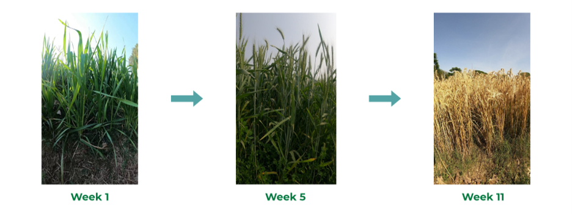
*Fig. 11 — Wheat crop cycle across the season (weeks 1, 5, 11).*

| Parameter | Value |
|---|---|
| Wheat variety | Galaxy |
| Rows used | 2 |
| Weekly datasets | 11 |
| Collection period | January – April |
| Capture | GoPro Hero 9, 2.7K, 120 fps |
| Classes | Wheat head, tiller, leaf stripe rust |
| Base images | 1,163 (manually annotated in Roboflow Universe) |
| After augmentation | 8,265 |

**Augmentations:** horizontal + vertical flip, 0–25% crop/zoom, ±15° rotation, ±24% brightness, up to 2.5 px blur, up to 1.92% pixel noise, 15° shear.

| Class | Instances before | Instances after | Factor |
|---|---|---|---|
| Wheat head | 13,051 | 29,846 | 2.3× |
| Tiller | 4,909 | 11,445 | 2.3× |
| Wheat stripe rust | 68 | 5,845 | ~86× |

Stripe rust is heavily under-represented in the raw data because it only appears in the later weeks of the cycle — hence the far more aggressive augmentation factor for that class.

<!-- PLACEHOLDER: Fig. 22 — annotated wheat imagery showing all three classes -->
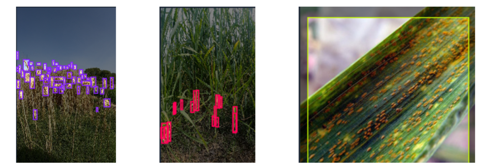
*Fig. 12 — Annotated wheat imagery: wheat head, tiller, leaf stripe rust.*

### Dataset config

`perception/dataset_custom.yaml`:

```yaml
path: /absolute/path/to/wheat_dataset
train: train/images
val:   valid/images
test:  test/images

nc: 3
names:
  0: head
  1: tillers
  2: Wheat Stripe Rust
```

### Training

```bash
cd perception
python train.py
```

| Parameter | Value |
|---|---|
| Image size | 640 px |
| Optimizer | AdamW, lr = 0.001 |
| Loss | Binary cross-entropy |
| Box loss gain / class loss gain | 7.5 / 1.5 |
| Early-stopping patience | 40 epochs |
| Scheduler | Cosine LR, `close_mosaic` late in training |
| Mixed precision | Enabled |

The high box-loss gain relative to the classification-loss gain is deliberate: accurate localisation of small wheat heads matters more downstream than fine class margins.

> **Note:** `train.py` sets `workers=0` and `cache="disk"` for Windows compatibility. On Linux you can raise `workers` to 4–8 for a meaningful speedup. `batch` is also set conservatively — increase it if you have the VRAM.

### Inference

```bash
cd perception
python predict.py
```

> **Note:** `train.py` and `predict.py` currently contain absolute Windows paths from the development machine. Edit the `YOLO(...)` weight path and `source=` directory in `predict.py`, and the `data=` path in `train.py`, before running.

<!-- PLACEHOLDER: Fig. 23 — tiller detection and wheat head detection side by side -->
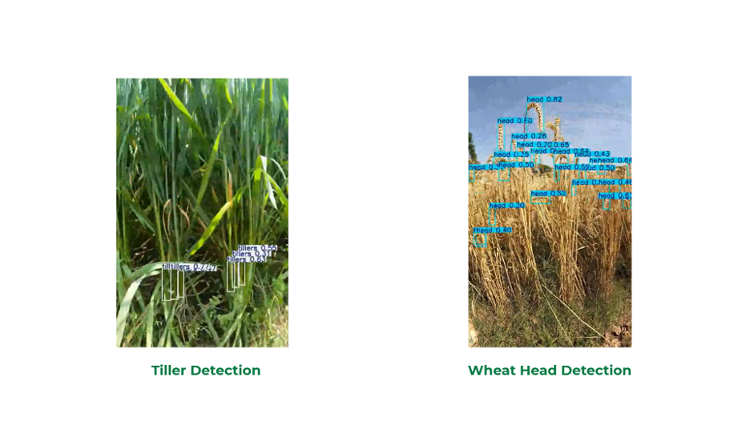
*Fig. 13 — Tiller and wheat-head detection output.*

---

## Results

### Field trials

Two campaigns of 40 trials each on the LUMS wheat plots — raised beds 0.6 m wide and 30.48 m long, 10 crop rows separated by 0.23–0.28 m embankments inclined at 40–50°. Detection range was 1.3–2.0 m for both pipelines.

| Behaviour | Trials | Successes | Success rate |
|---|---|---|---|
| Obstacle avoidance (static box, low-profile soil bag) | 40 | 31 | **77.5%** |
| Row-end turning (2 orange cone markers) | 40 | 28 | **70%** |

**Obstacle-avoidance failures** came from obstacles shorter than the 5 cm height-above-ground filter (under-counted into the corridor mask), and from entering `DRIFT_OUT` too late after a confirmed detection.

**Row-end-turning failures** came from direct sunlight on the cones moving the orange hue outside the HSV band, and from cones occluded by tall wheat heads near maturity.

The two failure modes were **not statistically independent** — several afternoon runs failed both behaviours — which makes lighting the single most influential confound on overall mission success.

Across all 80 trials the rover maintained traction, balance, and controlled motion on the embankments with **no chassis failures or sensor disconnections**.

<!-- PLACEHOLDER: Fig. 16 — wheat beds and crop rows at the LUMS test plot -->
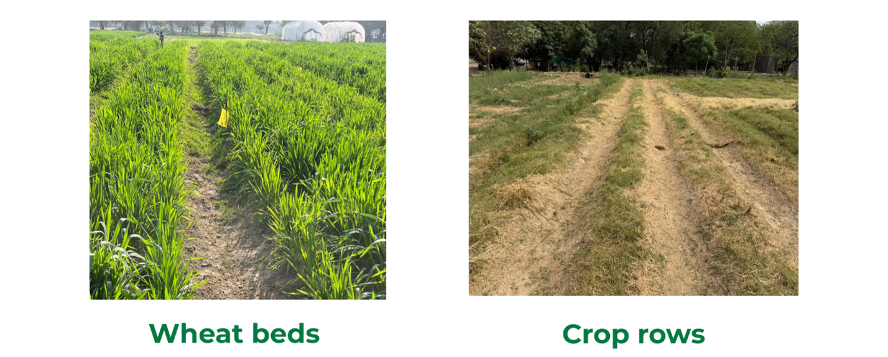
*Fig. 14 — Wheat beds and crop rows (LUMS test plot).*

### Detection model

| Class | Accuracy | Precision | Recall |
|---|---|---|---|
| Leaf stripe rust | **97%** | 97.3% | 97.3% |
| Wheat heads | 76% | 81.8% | 77.3% |
| Tillers | 74% | 60.8% | 70.2% |

mAP@0.5 across all classes: **0.817**.

Stripe rust — the most actionable agronomic class, and the whole point of early scouting — is effectively solved. Tillers trail the others for two reasons: they look like the surrounding green canopy at the same growth stage, and their bounding boxes are inherently ambiguous when a single tiller is partly occluded by neighbouring leaves.

Loss curves show training box loss decreasing smoothly while validation box loss plateaus higher — mild overfitting on localisation — with training and validation classification losses converging at similar values.

<!-- PLACEHOLDER: Fig. 24 — precision-recall and F1-confidence curves -->
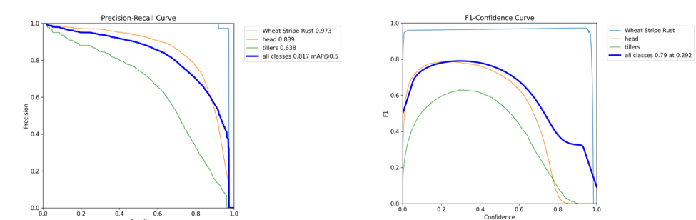
*Fig. 15 — Precision–recall and F1–confidence curves.*

<!-- PLACEHOLDER: Fig. 25 — box loss and classification loss curves -->
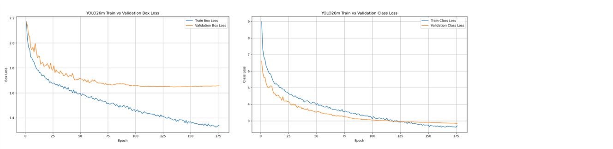
*Fig. 16 — Box and classification loss curves.*

---

## Tuning Guide

All tuning constants live in the header block of `navigation/nav.py`, grouped by subsystem.

**Rover weaves down the row.** Lower `KP`, or lower `LATERAL_GAIN` if the oscillation only appears after a lateral correction. Check that the standstill calibration actually completed — a bad target heading looks exactly like bad gains.

**Rover holds heading but drifts steadily to one side.** Raise `LATERAL_GAIN`. If the drift is always the same direction, check `LATERAL_SIGN` and `IMU_SIGN`.

**Phantom obstacles from the embankments.** Widen `FLAT_WIDTH_M` to match your actual bed, or raise `GROUND_HEIGHT_THRESHOLD_M`. Raise `MIN_OBSTACLE_PIXELS` and `OBSTACLE_CONFIRM_FRAMES` for a stricter confirm.

**Real obstacles missed.** Lower `MIN_OBSTACLE_PIXELS`, lower `GROUND_HEIGHT_THRESHOLD_M` (at the cost of ground false positives), or raise `DETECT_DISTANCE_M`.

**Cones missed in bright sun.** The saturated cone top wraps toward red, which the `H` lower bound of 0 already accommodates. If it still misses, drop `S`/`V` lower bounds from 70 toward 50 — and expect more false positives.

**Cones falsely detected on dry yellow grass or dirt.** Raise the `S` lower bound from 70 toward 100, or narrow the `H` upper bound from 28 toward 22.

**Turn overshoots or undershoots 90°.** Lower `TURN_ANGULAR_SPEED` for a slower, more accurate pivot, or tighten `TURN_HEADING_TOLERANCE_RAD`. If the turn times out repeatedly, the servo is likely saturating — check steering linkage and battery voltage.

---

## Troubleshooting

| Symptom | Likely cause and fix |
|---|---|
| `No ESP serial device found` | ESP32 not enumerated. Check `ls /dev/ttyACM* /dev/ttyUSB*` and `dialout` group membership |
| Rover doesn't move after typing `auto` | `nav.py` isn't publishing. Check `ros2 topic hz /cmd_vel` |
| Node logs an IMU timeout and stops | `/imu` stalled. Confirm the IMU node is alive and on the right serial port/baud |
| Cones never confirm | `align_depth.enable:=true` was omitted — the aligned depth topic isn't being published |
| Obstacle pipeline never fires | `/camera/camera/depth/camera_info` not received, so intrinsics are unset |
| Camera streams drop out or won't start | USB 2.0 port or a thin cable. The D435 needs USB 3.0 bandwidth — verify with `realsense-viewer` before blaming ROS |
| No camera topics at all | `realsense2_camera` node died on launch. Check the launch terminal for a `librealsense` device-busy error — `realsense-viewer` left open will hold the device |
| Camera frame rate collapses mid-run | Too many streams enabled. Use the reduced launch configuration in Step 2 and confirm the point cloud is off |
| Heading never locks at startup | Rover was moving during calibration; restart and hold it still |
| Pi reboots under load | Motor transients reaching the Pi rail — the power bank must be genuinely isolated |

---

## Cost Breakdown

All prices in PKR, reflecting local market prices at time of procurement (late 2025 / early 2026).

| Component | Cost (PKR) |
|---|---|
| Outsourced chassis (4WD platform with motors and suspension) | 30,000 |
| ESC + high-torque servo + ESP32-S3 | 10,000 |
| 7.4 V 2S 4000 mAh LiPo battery | 12,000 |
| GoPro Hero 9 (with adjustable mount) | 85,000 |
| Raspberry Pi 5 (8 GB RAM, 128 GB storage) | 25,000 |
| Intel RealSense D435 depth camera | 60,000 |
| USB power bank (10,000 mAh) | 5,000 |
| 3D-printed cover and acrylic base plate | 7,000 |
| WheelTec N100 IMU | 8,000 |
| **TOTAL** | **242,000** |

Roughly 70% of the cost sits in three imported components: the GoPro, the RealSense, and the Pi 5. Since the GoPro is used *only* for high-frame-rate dataset acquisition, a production-oriented build could drop it in favour of the RealSense colour stream (or a low-cost rolling-shutter USB camera), bringing the total **below PKR 150,000** with no meaningful change in detection performance on the targeted classes.

For comparison: EarthSense's TerraSentia, the closest commercial analog, lands in the high five-figure USD range once import duties, software licensing, and support are included. Research prototypes like Purdue's P-AgBot aren't commercially available and depend on 3D LiDAR rigs that cost tens of thousands of dollars on their own.

---

## Limitations and Future Work

**Known limitations**

- No global position estimate — detections cannot currently be geotagged or revisited.
- HSV cone thresholding is the single largest contributor to row-end-turning failure under direct sunlight.
- The originally planned nutrient-stress class was deferred; rare-symptom classes need collection windows longer than one semester.
- The decision-support dashboard exists only as offline plotting, not an in-field UI.
- No global replanning: a row blocked end-to-end results in `STOPPED` and requires operator intervention.

**Future work**

- **Localisation and mapping** — GPS at the headlands (where signal is available) plus visual odometry inside the rows, so detections can be geotagged and hotspots revisited.
- **Decision-support dashboard** — per-row, per-week aggregation with geotagged stripe-rust clusters, supporting targeted spraying instead of blanket application.
- **Learned cone detection** — a small dedicated YOLO head for cones, trained on the same season of footage, would remove HSV lighting sensitivity entirely.
- **Reduce box-loss overfitting** — stronger augmentation and a longer schedule to narrow the train/validation box-loss gap.
- **Drop the GoPro** — switch dataset capture to the RealSense colour stream, simplifying the wiring and mount.
- **Multi-rover operation** — N units on parallel rows cut total scouting time by a factor of N and naturally cross-validate detections.
- **Telemetry link** — 4G or LoRa streaming heading, lateral offset, and detection counts to the operator, enabling unsupervised overnight runs.
- **Other crops** — the pipeline is crop-agnostic; a comparable seasonal dataset on rice, maize, or cotton would broaden impact directly.

---

## Team

| Name | Roll No. |
|---|---|
| Huzaifa Saeed | 26100070 |
| Mohammad Junaid | 26100391 |
| Mohid Joya | 26100141 |
| Virad Munir | 26100285 |

**Advisor:** Dr. Hassan Jaleel, Assistant Professor, Department of Electrical Engineering, LUMS.

---

## Acknowledgments

Our thanks to Dr. Hassan Jaleel and his research assistants Muhammad Ibrahim Rana and Muhammad Ahson Hassan for continuous guidance and feedback throughout the project; to the Department of Electrical Engineering and the Syed Babar Ali School of Science and Engineering at LUMS for laboratory facilities, equipment, and access to the on-campus wheat plots; to Dr. Jahangir Ikram for assistance with hardware fabrication and procurement; and to the farm staff for maintaining the test environment across repeated field trials.

---

## Citation

```bibtex
@techreport{rowsense2026,
  title       = {RowSense: An AI-Enabled Unmanned Ground Vehicle (UGV)
                 for Under-Canopy Crop Scouting},
  author      = {Saeed, Huzaifa and Junaid, Mohammad and
                 Joya, Mohid and Munir, Virad},
  institution = {Lahore University of Management Sciences},
  type        = {BS Electrical Engineering Senior Project},
  year        = {2026},
  note        = {Advisor: Dr. Hassan Jaleel}
}
```

---

## License

Released under the MIT License — see [LICENSE](LICENSE).

Third-party components retain their own licenses: `ros2_wheeltec_n100_imu` (NDHANA94), `serial-ros2` (RoverRobotics fork), and Ultralytics YOLO. **Note that Ultralytics is AGPL-3.0** — review its terms before any commercial use of the trained weights.

---

## References

1. S. Savary et al., "The global burden of pathogens and pests on major food crops," *Nature Ecology & Evolution*, vol. 3, no. 3, pp. 430–439, 2019.
2. EarthSense, Inc., "TerraSentia Autonomous Under-Canopy Phenotyping Robot." https://www.earthsense.co/terrasentia
3. K. Kim, A. Deb, and D. J. Cappelleri, "P-AgBot: In-Row & Under-Canopy Agricultural Robot for Monitoring and Physical Sampling," *IEEE Robotics and Automation Letters*, vol. 7, no. 3, pp. 7942–7949, 2022.
4. O. L. García-Navarrete et al., "Application of Convolutional Neural Networks in Weed Detection and Identification: A Systematic Review," *Agriculture*, 2024.
5. I. N. Yulita et al., "A Convolutional Neural Network Algorithm for Pest Detection Using GoogleNet," *AgriEngineering*, 2023.
6. M. S. Krishna et al., "Plant Leaf Disease Detection Using Deep Learning: A Multi-Dataset Approach," *J*, 2025.
7. S. Islam et al., "Nutrient Stress Symptom Detection in Cucumber Seedlings Using Segmented Regression and a Mask R-CNN Model," *Agriculture*, 2024.
8. A. R. Bahtiar et al., "Deep Learning Detected Nutrient Deficiency in Chili Plant."
9. Z. Li et al., "A high-precision detection method of hydroponic lettuce seedlings status based on improved Faster R-CNN," *Computers and Electronics in Agriculture*, vol. 182, 2021.
10. A. N. Sivakumar et al., "Learned Visual Navigation for Under-Canopy Agricultural Robots," *Robotics: Science and Systems (RSS)*, 2021.
